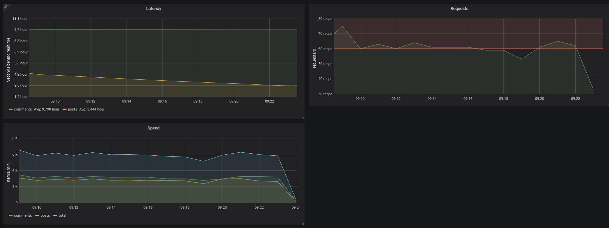

# reddit_feed

Fault-tolerant daemon that fetches comments & 
submissions from reddit and publishes serialised
 JSON to RabbitMQ for real-time ingest.

Can read up to 100 items per second (~6k/min), as per the API limits for
a single client.

Can optionally push monitoring data to InfluxDB. Below is an
example of Grafana being used to display it.

The daemon will attempt to stay exactly `REALTIME_DELAY` (60 by default)
seconds 'behind' realtime items. Of course, it can lag several minutes
behind when the number of events exceeds 100/s. In this case, 
it will eventually catch up to the target time during lower traffic
hours.



Tested on GNU/Linux amd64, it uses ~60Mb of memory.

### Usage
```
python run.py <RabbitMQ host>
```

(It is recommended to run with `supervisord`, 
see [supervisord_reddit_feed.ini](supervisord_reddit_feed.ini))